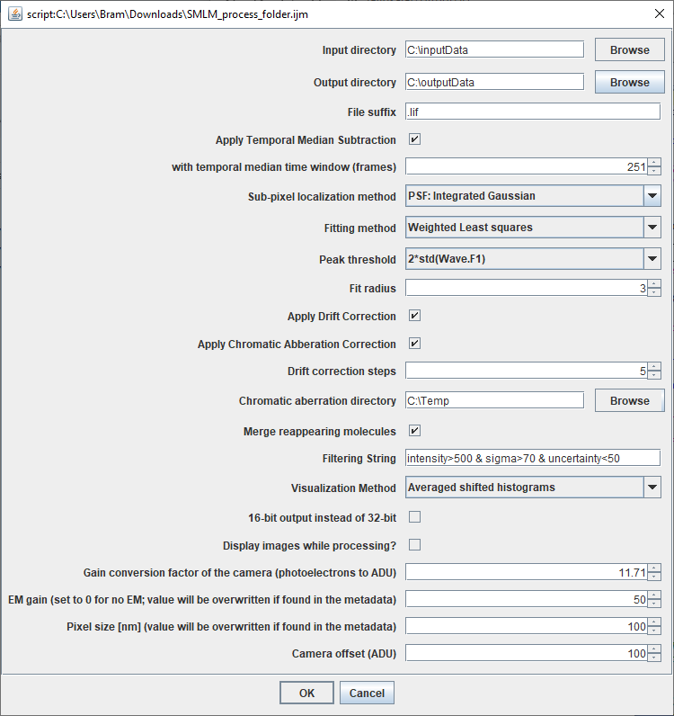

## Single-Molecule Localization Microscopy Tools

Here you can find several [Fiji](https://fiji.sc) scripts for automated reconstruction of Single-Molecule Localization Microscopy (SMLM) images.

### [SR_postProcess.ijm](https://github.com/Jalink-lab/Temporal-Median-Background-Subtraction/releases)
This macro is basically a wrapper around the ImageJ plugin [ThunderSTORM](https://zitmen.github.io/thunderstorm/).
It allows processing multiple blinking movies in a folder. In the dialog the most important settings of ThunderSTORM can be set. (Other parameters are set to default, and/or can be changed in the macro code before running. _(@rharkes nog even checken of dit waar is?)_

We have included a few convenient extras, such as [Temporal Median Background subtraction](https://github.com/Jalink-lab/Temporal-Median-Background-Subtraction/releases) ([paper]https://www.nature.com/articles/srep03854)) and Chromatic Aberration Correction sing affine transformations.

## What do you need:
### 1. [SMLM_process_folder.ijm](https://raw.githubusercontent.com/Jalink-lab/SMLM-macro/master/SMLM_process_folder.ijm)
### 2. [ImageJSON plugin](https://github.com/Jalink-lab/ImageJSON/releases/download/v1.0/ImageJSON-1.0.0.jar)
### 3. [Temporal Median Background subtraction plugin](https://github.com/Jalink-lab/SMLM-macro/blob/master/SMLM_process_folder.ijm)
### 4. [Chromatic Aberration Correction plugin](https://github.com/Jalink-lab/Chromatic-Aberration-Correction/releases/download/v1.12/Chromatic-Aberration-Correction-1.12.jar)

All settings (both from this macro and ThunderSTORM-specific settings) are saved in JSON files.
<!-- .element height="50%" width="50%" -->
